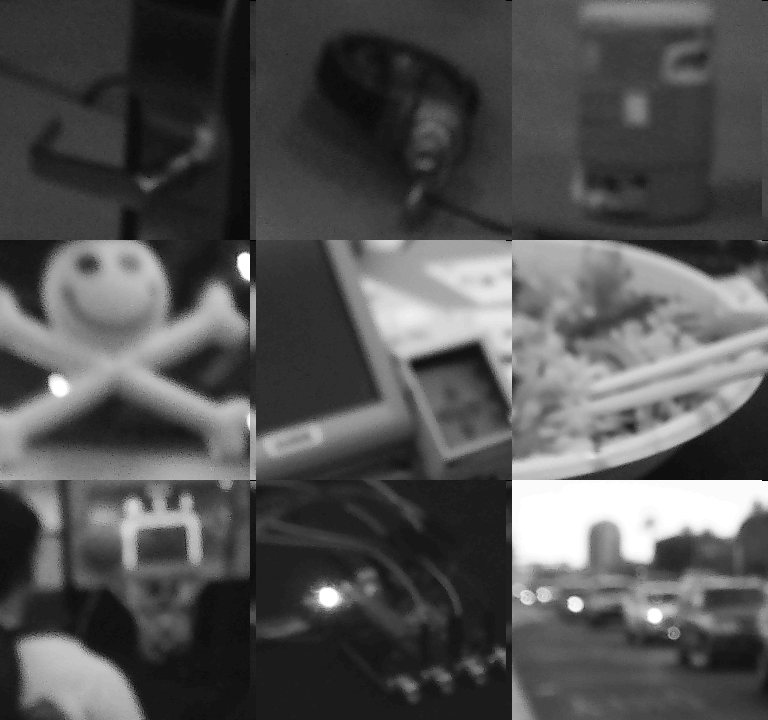
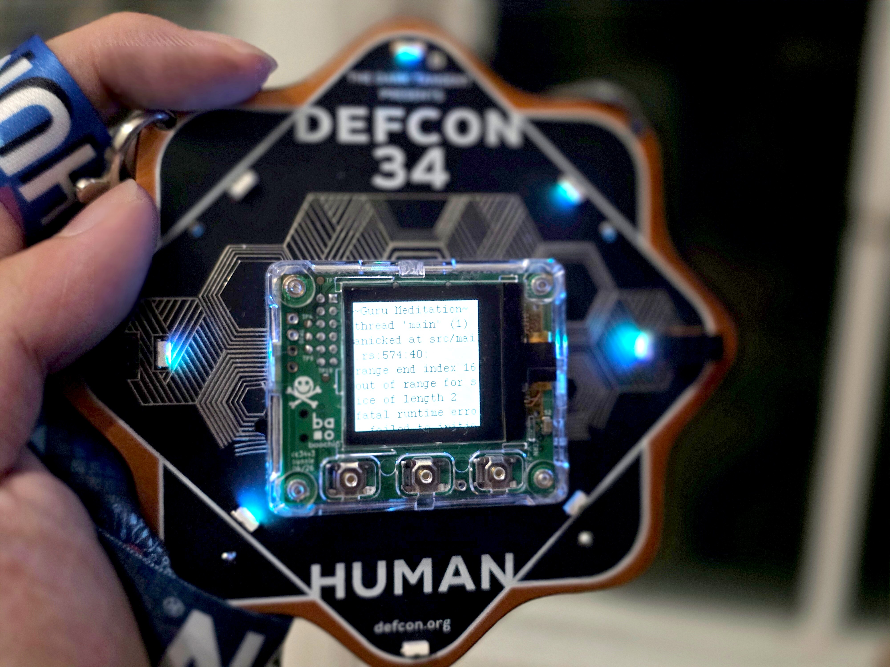
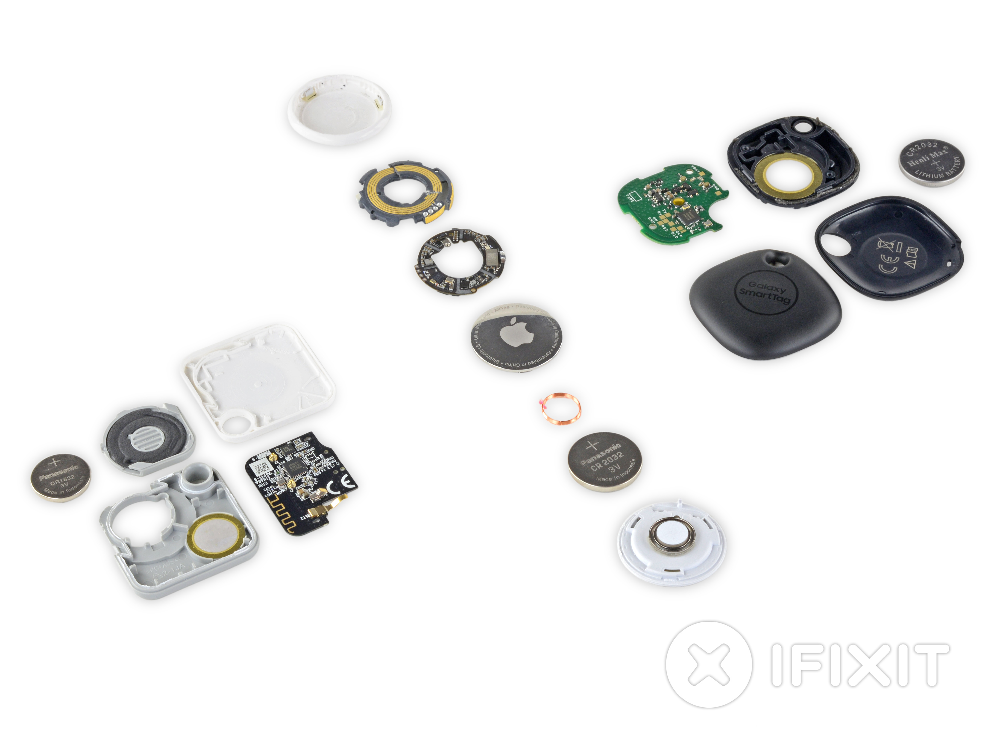
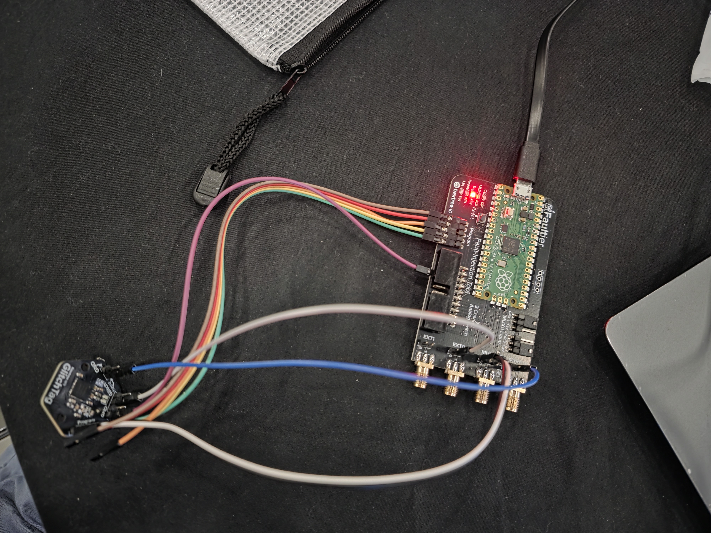
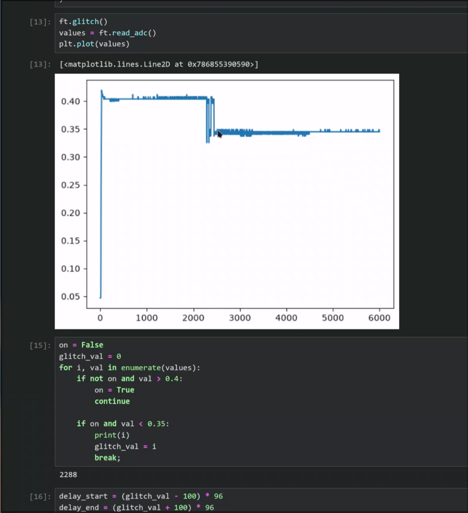
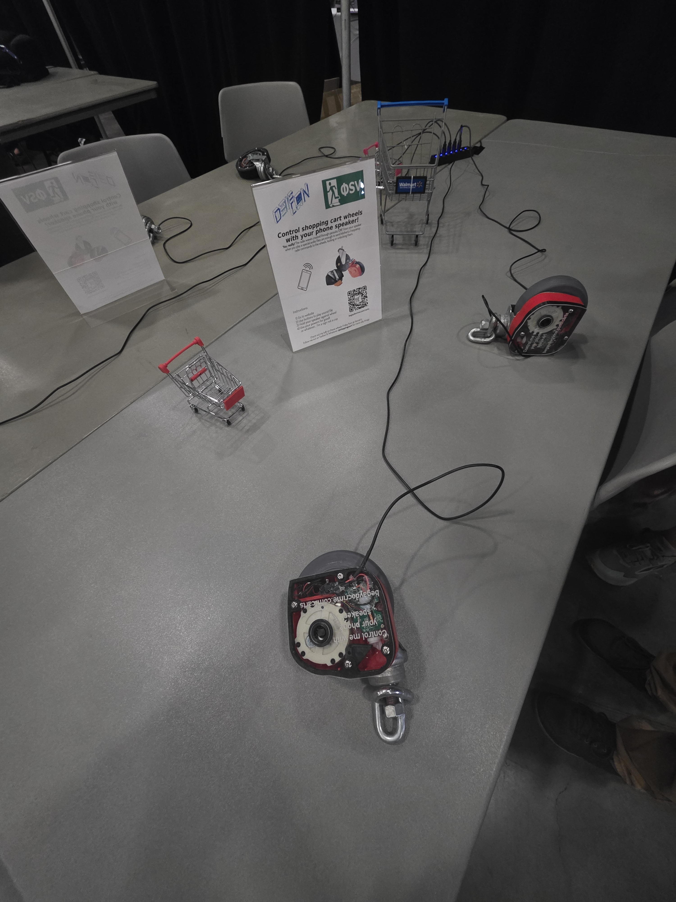
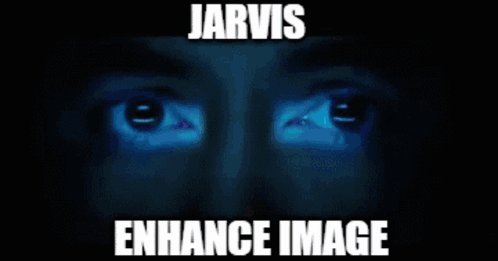
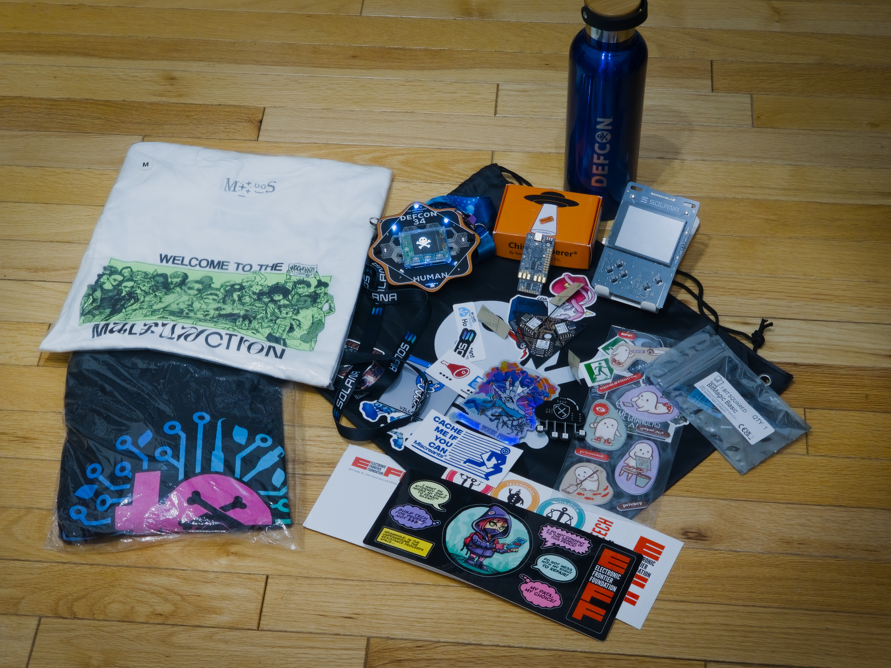

import BadgeCameraDemo from "../../images/DEFCON34/badge-camera-demo.mp4";
import DoomSolanaBadge from "../../images/DEFCON34/doom-solana-badge.mp4";

to summarize my experience at DEF CON 34 in one word: overwhelming.

There was an overwhelming number of talks and events; I would scroll for minutes
through the DEF CON schedule app just to realize that I'm still looking at the
10:00 AM talks and haven't made it forward in time.

I've gained an overwhelming amount of information and experience; from my first
successful CPU fault injection against a still supported nRF52832 CPU, to my
first side-channel attack against an STM32F0 chip, or learning how to bypass
certain types of physical locks, and experimenting with a novel SoC made by an
individual. Needless to say, there was a lot to ingest in the three days I was
at DEF CON.

and most importantly, overwhelmingly fun. Lots of people willing to talk and
share their journey. It's the DEF CON community that makes the whole puzzle fit
together.

And just a big thanks to Duke Cyber for sponsoring my trip over!

## badges

Made by [bunnie][bunniepedia], this year's badge contains a fully custom
[open-source][baochip] SoC called the [Baochip 1x][baochip-docs]. It's rocking a
solid 350 MHz RISC-V core (based on VexRiscv RV32-IMAC) and 2MiB of SRAM with
4MiB of flash. Aside from being really, really impressive (blows my mind that an
individual designed custom silicon!), bao1x is also built with security in mind,
so it's got virtual memory support w/ MMU, hardware crypto-processors, true
random number generation, hardware glitch sensors, basically the entire works.

along with the 350 MHz application CPU are four (!) 700 MHz "bao" I/O
co-processors. These are also RISC-V based (PicoRV32EC) connected to the main
CPU via an array of FIFO queues, DMA, and an event manager. These 700 MHz cores
are intended to handle the GPIO pins via the 'abuse' of registers r16-31.

Ok, so the hardware is cool, but what does it do? Along with being a hardware
key/password manager, the main attraction is the surrounding 8 RGB LEDs. Taking
inspiration from nature, the LED colors and animation are derived from a genetic
sequence that lives in the chip. You can mix genes with another badge through an
encrypted QR exchange protocol using the small camera (GC0308, a 0.3 megapixel
VGA cam) built into the badge.

When I saw the badge had an onboard camera, and a small OLED screen, one idea
immediately filled my mind. I wanted to turn this into a camera. That night,
after the conference, I cloned all the different repos that make up the firmware
of the card: dc34-api, dc34-console, dc34-image, dc34-vault, and xous-core,
wrote a quick nix devshell, and got to work.

The firmware runs on the xous microkernel which enforces strict boundaries
between services via the bao1x's MMU and provides an IPC solution for
communication. In the `bao-video` service, I added an opcode for snapping
pictures. A lot of code from the QR functionality could be reused but cannot be
used entirely as-is. For more reliable QR detection, the QR path applies bit
depth reduction, reducing the monochrome output to strictly white and black. For
a general purpose camera, this loses too much quality, so instead the frame is
stored unprocessed in memory.

```rust title="services/bao-video/src/main.rs" collapse={12-30}
if let Some(mut envelope) = snap_request.take() {
    let captured = k == '🔥';
    if captured {
        // stash the full-resolution grayscale before anything else gets
        // a chance to overwrite `frame`
        last_snap = Some(Box::new(frame));
    }
    let acquisition = FrameAcquisition {
        bits: if captured { frame_to_bitmap(&frame) } else { [0u32; 512] },
        captured,
    };
    let mut response = unsafe {
        xous_ipc::Buffer::from_memory_message_mut(
            envelope.body.memory_message_mut().unwrap(),
        )
    };
    response.replace(acquisition).unwrap();
    if orientation == DisplayOrientation::UpsideDown {
        display.flip_vertical(true).unwrap_or_else(|_| {
            display_timeout_handler(&udma_global, &mut display)
        })
    }
    // remove "frozen" frame
    display.clear();
    display
        .redraw()
        .unwrap_or_else(|_| display_timeout_handler(&udma_global, &mut display));

    hal.set_preemption(true);
    shutter_consumed_key = true;
}
```

To download the picture, I reused the existing USB serial interface, with a new
command to send the greyscale frame down the wire. Since USB is handled by
another, separate, service, I wired in another opcode in `bao-video` that will
transfer chunks of data from bao-video's memory.

```rust title="services/bao-video/src/main.rs" collapse={2-3}
GfxOpcode::ReadSnapChunk => {
    let mut buffer =
        unsafe { Buffer::from_memory_message_mut(msg.body.memory_message_mut().unwrap()) };
    let mut chunk = buffer.to_original::<SnapChunk, _>().unwrap();
    let start = chunk.index as usize * SNAP_CHUNK_SIZE;
    chunk.valid = false;
    if let Some(snap) = last_snap.as_ref() {
        if start + SNAP_CHUNK_SIZE <= snap.len() {
            chunk.data.copy_from_slice(&snap[start..start + SNAP_CHUNK_SIZE]);
            chunk.valid = true;
        }
    }
    buffer.replace(chunk).unwrap();
}
```

Then a simple python script running on my phone via Termux, utilizing the Termux
USB API, will pull the photo and store it as a PNG file. I tried using WebUSB
for this, but could not get Chrome on Android to detect the badge, but Termux
worked perfectly when trying to open the USB serial connection.

<figure>
  <video src={BadgeCameraDemo} width={300} controls preload="metadata" />
  <figcaption>
    Snapping a photo on the badge and viewing it on the OLED.
  </figcaption>
</figure>

Then, once the con started, I utilized this to take pictures all around the
venue. Following the DEF CON photo policy, no pictures of others were taken
without permission (not like you can really make them out anyways with this
resolution 😅).



Flashing custom firmware has one downside though. For the badge to badge gene
exchange mentioned earlier, it relies on a secret key stored in pddb (which you
can read more about in [bunnie's blog post][pddb-bunnie]). When you upload your
own, unsigned, firmware, this key is destroyed and functionality to show your QR
and scan others is disabled. Part of the challenge for the badge is to find this
key (known as k0) which can be done by collecting enough samples and
brute-forcing the rest using a GPU.

But this unlocks the opportunity for something else. While inspecting the
firmware I found [this GitHub issue][dc34-vault-oob] where certain QRs can cause
the badge to panic. The original code reads as follows,

```rust
match base45::decode(&s.s.as_bytes()) {
    Ok(data) => {
        log::debug!("b45dec: {:x?}", data);
        if data[..DC34_HEADER.len()] == DC34_HEADER {
            // assume we're scanning their key
            if data.len() < DC34_HEADER.len() + size_of::<Nonce>() {
                log::error!("protocol error: key is not long enough");
```

notice that after running base45, data is immediately sliced to
`0..DC34_HEADER.len()` without any explicit bounds checking! Since Rust is a
memory-safe language, this doesn't cause undefined behavior, and instead raises
a panic.

As a quick demo, I encoded 'hi' into base45 and created a QR code. Scanning it
with my badge caused a panic and required a reboot to clear. So, I reprogrammed
the UI to add a button that shows this custom QR. Now whenever someone comes to
scan my badge, they're met with a temporary panic.



The keen-eyed among you may have noticed this section is titled "badges" plural.
During the con, I picked up another badge at the cryptocurrency village. The
company Solana was handing these out for free, and they contain an ESP32-S3,
320x240 touchscreen, dual mics, 1000mAh battery, some buttons, and the SE050
secure element.

The OEM firmware was pretty boring, just a test screen showing all the different
sensors. So, the obvious next step is to port DOOM. ESP-IDF has built-in support
for the ST7789-based display, so getting video was quite simple. Wired that up
to [doomgeneric][doomgeneric] and within no time I got DOOM running on the
thing.

<figure>
  <video src={DoomSolanaBadge} width={300} controls preload="metadata" />
  <figcaption>DOOM running on the Solana badge's ESP32-S3.</figcaption>
</figure>

## villages

At DEF CON, villages are like smaller, more focused, communities. Alongside the
previously mentioned crypto village there was the embedded village, maker
village, aerospace village, physical security village, and much more. Each
village holds their own talks and events.

### voltage glitching

The first village I really sat down at was the embedded village. There, they
were lending out a glitching kit to those who wanted to learn. Intrigued, I
picked one up. The kit contained an RP2040-based board with a simple FET to turn
on and off power to a target board. The target was an nRF52832, the same SoC
that powers the Apple AirTags. The goal was to replicate the attack done on
[Apple AirTags][airtag-glitching] that allows you to dump the firmware of the
nRF52832 even when "APPROTECT" is enabled, bypassing the restriction that
typically exists.



The RP2040's PIO state machines execute at per-clock cycle level of precision.
And the nRF52832 has a correlation between the current draw and the boot
process. So by fault injecting the chip at the perfect moment, the chip will
skip the APPROTECT check and allow SWD connections, thus allowing you to dump
firmware.

Initially, I thought that it would be as simple as dipping the voltage on VCC to
the chip, but I quickly found that this is not the case. Like many chips, the
nRF52832 uses internal regulators to step down the 3.3V for the main processor,
and dropping VCC will affect other parts of the chip as well, like the RADIO
peripheral. The solution is to target only the processor by taking advantage of
the chip's external decoupling capacitors.

Having built around the nRF52840, the brother to the 32, I was aware that these
capacitors were used to smooth voltage coming out of the internal regulators for
the different parts of the chip. Specifically DEC1 was used for the main CPU. So
by hooking that up to a FET connected to ground, you can short the main
application core down to 0V.



I used a python notebook to graph the boot voltage, then used a stochastic
technique to find the perfect injection time. This highly advanced and
sophisticated method involved generating two random numbers and praying it
works. Yeahh, it was a matter of chance if the glitch would work or not since
silicon isn't perfect and there exist per-chip variations.



In the end though, I was able to retrieve the flag from the firmware, completing
the challenge. I also got to speak with the YouTuber
[LiveOverflow][liveoverflow] where I asked him questions about modern-day fault
injections and how chip designers try and defend against such attacks. He
explained how chips have in-built monitors that will reset the chip if an
unexpected voltage dip is detected. He described how other attack vectors
include EMI fault injection, where you try to induce a current via
electromagnetic waves to flip a bit in the chip or cause other malfunctions. It
was a great discussion and something I hope to experiment more with in the
future.

### side-channels

Over at the crypto village, they held a workshop on side channel attacks. This
is conceptually similar to the fault injections I just did but instead of trying
to get the chip to do something in your favor, the goal is to extract
information from variables like the chip's current etc. To demonstrate, they
handed out small boards called the ChipWhisperer Nano. It's a small
STM32F0-based board with an 8-bit ADC capable of 20M samples/sec.

Though it was at this point the WiFi at DEF CON was starting to really slow
down, so after spending an hour trying to get the environment set up, I decided
to defer the experimentation to later.

### cuffed? no problem

At the physical security village, they had many demo stations to teach about...
well... physical security.

Ever seen those grocery store carts that lock up if you bring them out of range
from the store's perimeter? Well the way those work is through a simple signal
generated by a wire that surrounds the perimeter. This signal lives in the kHz
range and is something a simple phone speaker could replicate. By playing a
certain frequency tone on my phone's speaker, I was able to freely lock and
unlock these carts!



On the more physical side, I learned how to escape handcuffs using a bobby pin,
and how to enter locked buildings using rudimentary metal tools. It's
mindblowing how it's not illegal to teach these skills, but hey, I'm not
complaining.

### n much much more

these are just a few of the many villages I saw, with some leaning more towards
the policy side rather than electrical. There's honestly too much to write about
in one blog post, but I'd like to give an honorary mention to the voting
village, specifically Philip, who spent years investigating voting fraud and
provided really great evidence on how election security is something that we
should care about. You can check out part of his talk
[on YouTube](https://www.youtube.com/watch?v=toi0keDnOsc).

## talks

no matter who you are, DEF CON will have a talk you are interested in. They
range from surface/beginner level to deep dives on complex topics. The talks
also vary greatly in quality too, but definitely lean towards the higher quality
side of the spectrum.

For example, one of the talks I watched was about a bug in the Linux kernel's
handling of USB UVC, where an out-of-bounds write could lead to LPE/code
execution. This talk was one I definitely had to lock in to understand, where
zoning out for one second meant you missed some key information that derailed
the rest of the talk. It was highly technical, going into how device descriptors
etc worked, and showing off snippets of kernel code that made the attack
possible. The presenters have published [a paper][usb-attack] on this attack if
you're interested.


On the other side of the spectrum was a talk about "hacking" Amazon delivery
lockers. The talk was super engaging; it's an event where "you had to be there"
to understand. From a technical standpoint, it's not the most impressive attack
out there. There wasn't some exploited Bluetooth attack, or some malicious API
calls involved, instead it relied on OSINT to find leaked Chinese videos on
locker maintenance and social engineering to get lock manufacturers to
manufacture a copy of the key based on a still from the videos. This talk was
more about the journey rather than the end product, but the speaker shared this
journey in such an engaging way that made it one of the highlights of my time at
DEF CON.



Lastly, there are still some talks that felt akin to 'ai slop,' where you can
tell the slides were AI generated (or at least heavily AI-assisted) and the
contents included "i let claude work overnight and i got this" a few times. But
regardless, there's so many talks that such variance is expected, and these were
like outliers. It did not take away from the overall experience of the con.

## party life

I didn't go to any DEF CON parties.

## vegas

Las Vegas is

- hot, reaching upwards of 47°C!
- expensive, bottled water did not come with my hotel room and costs \$5-7 in
  most stores, and a single monorail ticket is \$5.50.
- has mid-at-best public transport, the monorail is quite a walk away from the
  hotel and the conference, and is generally slower than any other public
  transport system I've used.

and honestly, the entire city feels so dystopian, but not because it's
futuristic. It's built in the middle of a hostile desert and runs entirely off
of the money made from people gambling. Everything is engineered to make you
want to gamble, as going anywhere means walking through 5 casinos, out in the
near 50°C weather, and past 500 slot machines.

Though I'm not trying to fully hate on Vegas, it really is an interesting city,
unlike any other city I've been to. No other place lets you visit New York New
York, Paris, Rome, Egypt, and Venice all in one day. The Vegas identity is built
on larping as other cities but adding in a casino, a bar, and a club.

Food is alright, but the experience is 🤌. I got to eat dinner inside a
rainforest filled with life-sized animatronics and flashing lights + sound that
emulated the feeling of being in a thunderstorm.

![I forgot to take a pic, so here's a generic pic of Rainforest Cafe from [their website][rainforest-cafe].](../../images/DEFCON34/rainforest-cafe.jpg)

## takeaways

I'll end it with a quick rose bud thorn, in reverse:

Thorn: the AI frontier is eating everything up, I saw videos of people competing
in DEF CON CTFs by just spawning an agent per challenge all in parallel. It has
become a battle of token usage and model harnesses. This applies less to the
big, official DEF CON CTF challenges as that requires you to pre-qualify to
play, but for smaller comps I saw clips of people completely sitting laid back
while agents were whirring away. IMO, this goes against the spirit of the
competition. If you cannot explain how you solved a challenge without asking
Claude to summarize, is participation even useful? It's like racing horses
against humans, something that should be separated or at least regulated.

<blockquote class="twitter-tweet" data-dnt="true" data-theme="dark">
  <p lang="en" dir="ltr">
    i talked to a lot of people who played the defcon ctf finals to understand
    how llms affected them, both professionally and mentally.
    <br />
    <br />i went in hoping to learn that human intuition still mattered.
    instead, ctfs in their current form as everyone saying is dead, players are
    forced…
  </p>
  &mdash; s1r1us in sf 🌉 (@S1r1u5_){" "}
  <a href="https://x.com/S1r1u5_/status/2087562125074133332?ref_src=twsrc%5Etfw">
    August 12, 2026
  </a>
</blockquote>
<script async src="https://platform.x.com/widgets.js" charset="utf-8"></script>

Bud: I cannot wait to attend again. I saw someone wearing a 3D Printer as a
backpack, saw many cool badge addons, and generally so many cool projects that I
feel inspired to come again next year with something of my own to share.

Rose: I bet you can tell from the rest of this article, but I had such a great
time. Tons of engaging, deep talks and plenty of hands-on experience that's hard
to get on your own. It's stuff I've heard floating around but never got to
experience until now. At DEF CON, you're surrounded by people who share similar
interests, but live in different niches, creating opportunities to both share
ideas and open the door to many interesting conversations.

## bonus content: loot haul

All the loot I got from DEF CON. A lot of free stickers and small devboards.



in no particular order:

- Miscreants t-shirt
- DEF CON 34 hoodie
- DEF CON 34 badge
- DEF CON water bottle
- ChipWhisperer Nano
- Solana badge
- 1BitSquared BitMagic Basic
- Badge from Game Changers AI org
- Cloud Village SAO (badge addon)
- Misc stickers from Electronic Frontier Foundation, Miscreants, Nix Vegas
  Community, AppSec Village, Radio Village, and other villages and sticker
  exchange areas.

[baochip]: https://github.com/baochip/baochip-1x/
[baochip-docs]: https://baochip.github.io/baochip-1x/index.html
[bunniepedia]: https://en.wikipedia.org/wiki/Andrew_Huang_(hacker)
[pddb-bunnie]:
  https://www.bunniestudios.com/blog/2022/the-plausibly-deniable-database-pddb/
[dc34-vault-oob]: https://github.com/bunnie/dc34-vault/pull/1
[doomgeneric]: https://github.com/ozkl/doomgeneric
[airtag-glitching]:
  https://hackaday.com/2022/07/14/apple-airtags-hacked-and-cloned-with-voltage-glitching/
[liveoverflow]: https://www.youtube.com/liveoverflow
[rainforest-cafe]:
  https://www.vegasmeansbusiness.com/listing/rainforest-cafe/36484/
[usb-attack]:
  https://media.defcon.org/DEF%20CON%2034/DEF%20CON%2034%20presentations/DEF%20CON%2034%20presentations/DEF%20CON%2034%20-%20Alex%20Plaskett%2C%20Robert%20Herrera%20-%20Gone%20in%2060%20Frames%20-%20USB%20Video%20Exploitation%20-%20In60%20Whitepaper%20v1.pdf
