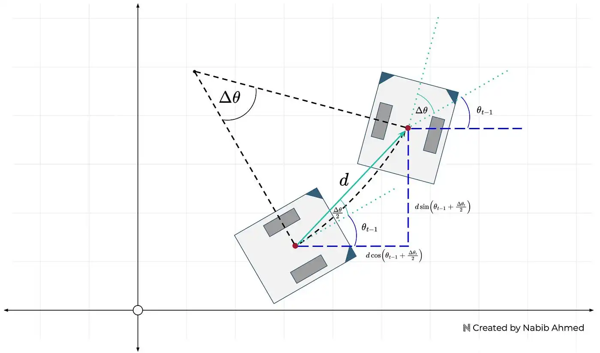
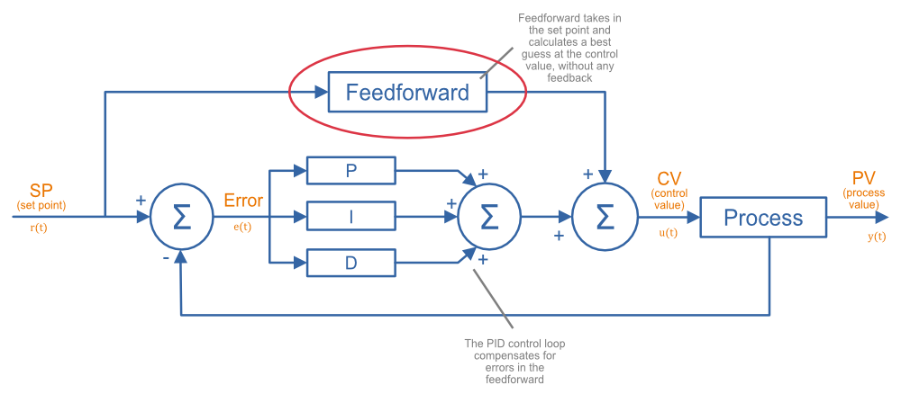
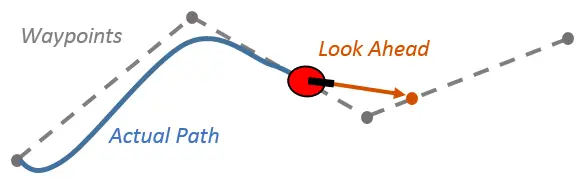
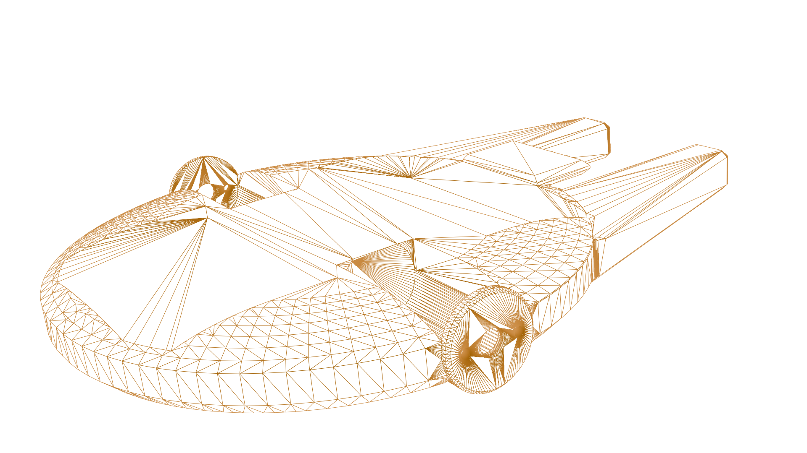

import { Image } from 'astro:assets';
import sciolygrid from '../../images/scioly-grid.webp';

Science Olympiad's Robot Tour throws down a gauntlet: navigate a maze-like
track autonomously, unseen until competition day, while trying to get a time as
close as possible to what the judges request, not any slower and not any
faster. There's a lot that goes into this problem. In this post, I'll detail my
approach to this competition.

I would like to preface that this is by no means a step-by-step introduction,
but is instead a starting point so you can start and do your own research on the 
different topics and concepts mentioned.

# 1. Tracking the robot

First, the robot needs to know where it is in the field so it can navigate
around. This calls for a concept known as Odometry. I'm not going to go into a
ton of detail in this post about how odometry works and the math behind it all
(it's very cool!). If you're interested, I'd highly recommend checking out
[this
article](https://medium.com/@nahmed3536/wheel-odometry-model-for-differential-drive-robotics-91b85a012299)
by Ahmed. 

For now, just know that wheel odometry takes in data about how far each wheel
has spun along with the robot's heading (what angle the robot is facing -- like
a compass) and the robot's dimensions and outputs the robot's position on a
cartesian plane.

For wheel odometry to work, we need two tracking wheels and a way to know the
heading of the robot. A tracking wheel is a wheel that knows how much
it has turned, we can use an encoder for that job. A quick Google search for a
motor with an encoder yielded me the following: Adafruit's [Geared DC Motor
with Magnetic Encoder Outputs](https://www.adafruit.com/product/4416).

Next, we need a way for the robot to know which way it is facing. Another
Google search later, and I found the
[MPU9250](https://www.amazon.com/HiLetgo-Gyroscope-Acceleration-Accelerator-Magnetometer/dp/B01I1J0Z7Y).
After receiving this sensor and setting it up with an Arduino and the [MPU9250
Arduino Library](https://www.arduino.cc/reference/en/libraries/mpu9250/), I
gave the sensor a test. I calibrated the sensor and then turned it 90 degrees.
It read 90 degrees. Good! I turned it another 90 degrees, it read 160
degrees... not great, turning it 90 degrees again, it read 300 degrees. After
hours of trying different libraries and trying to comprehend the math going on,
I gave up.

After a more thorough Google search, I landed on the [Adafruit
BNO085](https://www.adafruit.com/product/4754) which claims to be:
> "the motion sensor you were looking for: the one that just gives you the
> directly usable information without requiring you to first consult with a PhD
> to learn the arcane arts of Sensor Fusion."

Perfect! We've now got the two sensors we need for the robot.

# 2. Movement & Control

In the previous section, I ordered two DC motors with encoders. These motors
aren't going to spin themselves, so we need to get a Motor Controller or a
Motor Driver. I opted for the
[L298N](https://www.amazon.com/Qunqi-Controller-Module-Stepper-Arduino/dp/B014KMHSW6)
because not only was it very cheap, but it seemed to be quite popular in the
DIY space.

Lastly, to connect all these pieces together, we need a microcontroller.
Normally many people opt for an Arduino Uno since they are very versatile, but
I decided to opt for the Raspberry Pi Pico for the following reasons:

1. Two PIOs (Programmable Input/Output) that run independently from the CPU
   and can track the encoder ticks without having to interrupt the CPU.
2. Dual-core processor, which, while not completely necessary, is very nice
   to have since I can run the odometry algorithm on one core and handle
movement on another.

This project could run on an Arduino, but the Pico is also way cheaper and
smaller while providing more features.

# 3. The Programming

The official way to program the RPI-Pico is through their C++ pico-sdk library.
It has an ecosystem much smaller than the Arduino, so I had to implement a lot
on my own.

You can check out my [public
repo](https://github.com/ItzDerock/scioly-robottour-2024-cpp) if you are
interested in viewing the source code.

## Motor Control

In the second section, I mentioned ordering the L298N. The L298N is a Motor
*Driver* not a Motor *Controller*. The difference between the two is that a
Motor Driver is the "dumber" one of the two and solely exists to provide the
required power to the motor without doing any calculations to make the motor
hold a set speed. In the case of this competition, it's important to be able to
control the velocity (eg rotations/sec) of the wheels. To do this, I
implemented a Motor Controller that combined a PID loop and a feedforward
controller.

PID is a feedback controller that consists of three components:
1. Proportion: Responds directly to the error ($\text{target} - \text{actual}$)
   multiplied by the $K_P$ constant.
2. Integral: Responds to the buildup of error (aka the integral) multiplied by
   the $K_I$ constant.
3. Derivative: Responds to quick changes in the error multiplied by the $K_D$
   constant. 

By tuning the constants, you can create a system that can maintain a
certain velocity even if there is unexpected weight added onto the motor.

Feedforward is an added layer onto PID that lets the controller predict the
required change in output when there's a change in the target velocity. PID by
itself is a purely reactive controller, FF allows for it to quickly respond to
changes in the setpoint.

## Path Generation and Following

On competition day, you will be given 10 minutes to program the robot after
seeing the field and you are not allowed to test the movements during this
time, so it's important that inputs are as simple as possible. 

<Image width={600} class="mx-auto mb-6" src={sciolygrid} alt="Science Olympiad Grid"
/>

My idea is to have the user input the coordinates for each grid into an array
and then the code will translate each coordinate into absolute coordinates in
centimeters where the bottom left corner is (0cm, 0cm). Lastly, the robot can
interpolate intermediary points using some cool parametrics and basic algebra: 

$$
\begin{align}
 x_n = x_a + \frac{n}{d}(x_b-x_a) \\
 y_n = y_a + \frac{n}{d}(y_b-y_b)
\end{align}
$$

 
   ($d$ = distance between point a and b, $n$ is some number $0<n<d$)

Then we can use an algorithm like [Pure
Pursuit](https://www.ri.cmu.edu/pub_files/pub3/coulter_r_craig_1992_1/coulter_r_craig_1992_1.pdf)
to follow the final path. At its core, the robot calculates a point ahead on the desired path 
(aka the lookahead point) and then steers towards it. This simple technique allows for
smooth and continuous navigation along pre-defined paths.

There are some edge cases that we need to handle on our own though. Pure pursuit does not 
handle full 180deg turns well as it is incapable of stopping and turning in place. This results
in the robot making a huge curve to turn around. Cases like these need to be handled separately.
The robot should stop and turn 180 degrees and then continue following the pure pursuit path. 
A simple PID loop that tries to minimize the error between the current heading and the target
heading of 180deg + the starting angle should be enough.

## Time constraint

The last part of the competition is completing the path so that the elapsed
time matches as closely to what the judges want. 

Since we are pregenerating the entire path, we know the distance left that
needs to be traveled -- simply sum all the distances between the points. We
can take this and divide it by the remaining time to get the velocity we should
target. This can be fed into pure pursuit. If we constantly recalculate this,
we can get a robot that gets exactly the required time. You will need to be
careful and add some constraints to prevent the robot from stalling if the
velocity falls lower than what the motor can output. 

This is one of the benefits of using pure-pursuit, if we were to go the
naive approach of just chaining `moveDistance(...)` and `turnTo(...)` commands,
we would at runtime have no clue how much further needs to be traveled.

# Finishing thoughts

Hopefully this article was helpful and gave you some new insight on how to
create a robot for the Robot Tour event. My approach is definitely not perfect,
and the parts I chose can be improved. In the future, I plan on replacing the L298N 
with a full motor controller or just a better motor driver since the L298N has a 
pretty significant voltage drop.

The robot ended up working pretty well in testing, but I think there may have
been a slight inconsistency in how my practice field was set up as the
distances had to be tuned during the competition. This goes to show that your
robot will only be as good as it's weakest link, so you should always complete
every step as thoroughly as possible.

If you liked this post, check out my [Introduction to VEX
Robotics](/post/vex-robotics/introduction) where you can learn more concepts
related to robotics.

  Wireframe render of robot's chassis

